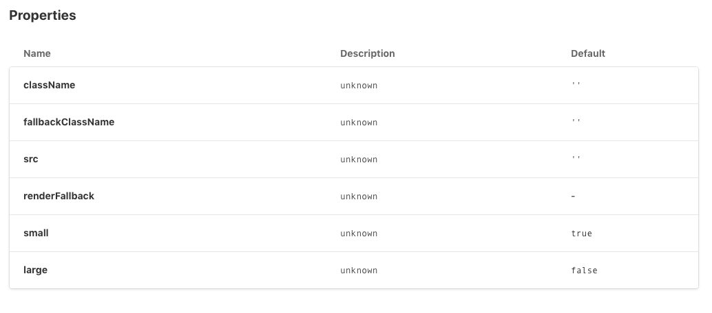

# storybook-flow-example

- no `flow` types in `@storybook/addon-docs` prop table (all props in table comes from `Component.defaultProps` and without description)
- all component props in 'Show code' flatten to single line

`yarn install`

`yarn start`
